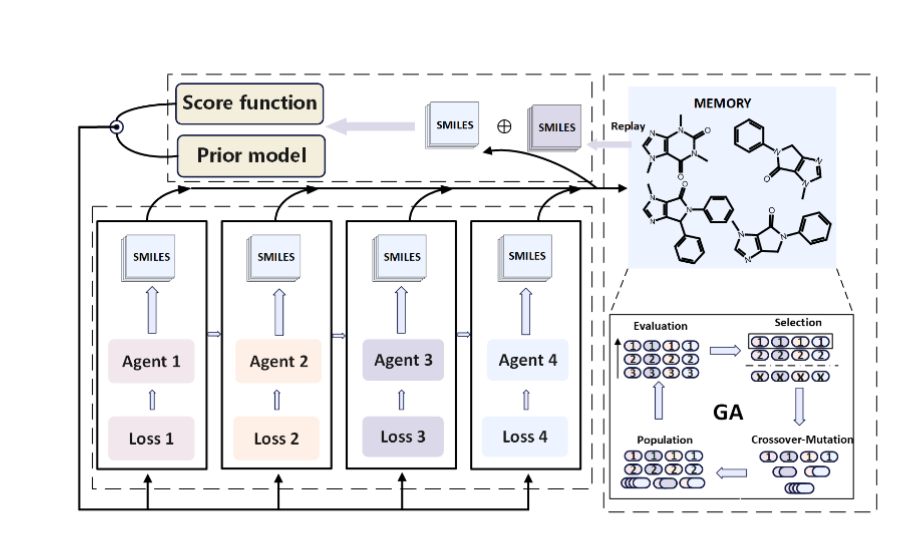
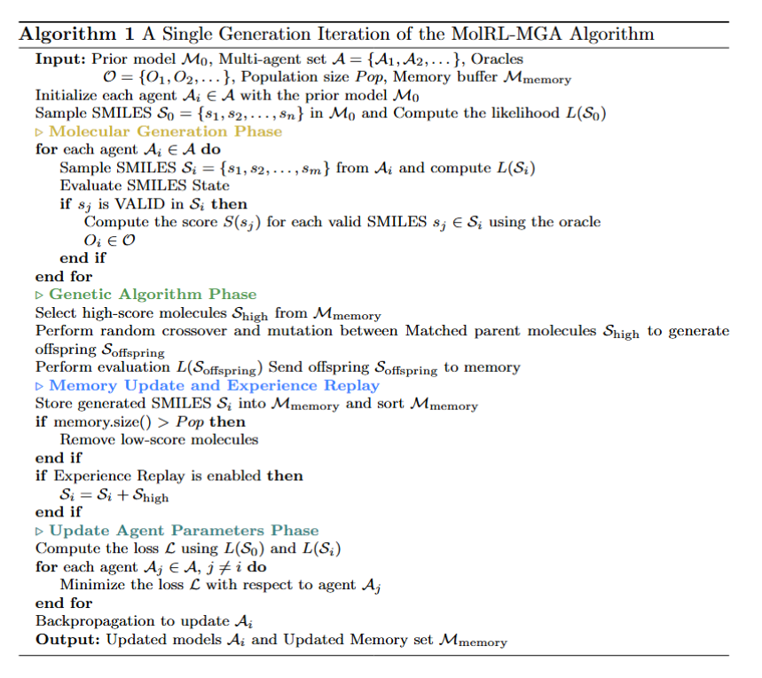
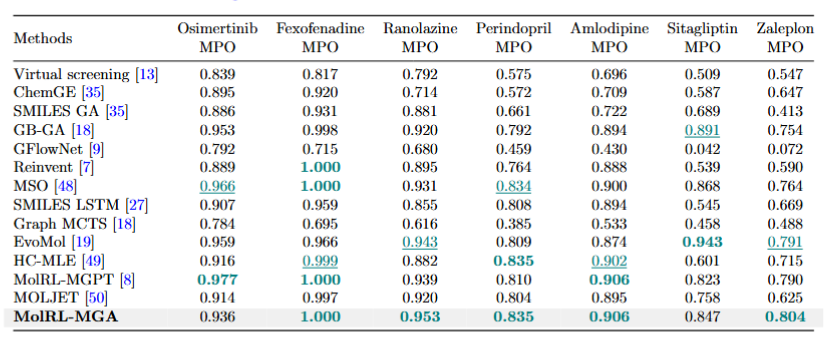

# 🧬 MolRL-MGA

[](https://www.python.org/)
[](https://pytorch.org/)
[](LICENSE)

> **Multi-Objective Drug Discovery via Genetic Algorithms and Reinforcement Learning in a Multi-Agent Framework**

This repository contains the implementation of a novel multi-agent reinforcement learning approach for molecular optimization and drug discovery, combining genetic algorithms with deep reinforcement learning techniques.

## 🌟 Features

- 🤖 **Multi-Agent Framework**: Collaborative agents for enhanced molecular exploration
- 🧠 **Reinforcement Learning**: State-of-the-art RL algorithms for molecular optimization
- 🔬 **Genetic Algorithms**: Evolutionary approaches for diverse molecular generation
- 🎯 **Multi-Objective Optimization**: Simultaneous optimization of multiple drug properties
- 📊 **Comprehensive Benchmarking**: Integration with GuacaMol and TDC benchmarks

## 🏗️ Architecture


*Figure 1: Multi-agent reinforcement learning framework architecture showing the interaction between genetic algorithms and RL components*

## 🚀 Quick Start

### Prerequisites

Ensure you have Python 3.7+ installed, then install the required dependencies:

```bash
pip install torch rdkit tqdm tensorboard PyTDC openbabel numpy pandas argparse
```

### 📦 Dependencies

| Package | Purpose |
|---------|---------|
| `pytorch` | Deep learning framework |
| `rdkit` | Chemical informatics toolkit |
| `tqdm` | Progress bars |
| `tensorboard` | Visualization and logging |
| `PyTDC` | Therapeutics Data Commons |
| `openbabel` | Chemical file format conversion |
| `numpy` | Numerical computing |
| `pandas` | Data manipulation |
| `argparse` | Command-line argument parsing |

## 🧮 Algorithm Overview


*Figure 2: Detailed algorithm workflow illustrating the multi-objective optimization process combining genetic algorithms with reinforcement learning*

## 💊 Usage

### Multi-Agent Reinforcement Learning

#### Drug Optimization Examples

**Osimertinib Optimization:**
```bash
python main.py --dpo osimertinib \
               --agents_num 4 \
               --sigma 120 \
               --memory_size 500 \
               --segam2 0.2 \
               --max_steps 600
```

**Fexofenadine Optimization:**
```bash
python main.py --dpo fexofenadine \
               --agents_num 3 \
               --sigma 140 \
               --memory_size 1000 \
               --segam2 0.2 \
               --max_steps 1400
```

### 🔧 Configuration Parameters

| Parameter | Description | Default | Range |
|-----------|-------------|---------|-------|
| `--dpo` | Target drug/task identifier | `task_23` | Custom |
| `--agents_num` | Number of collaborative agents | `4` | 1-10 |
| `--sigma` | Score function impact weight | `120` | 50-200 |
| `--memory_size` | Experience replay buffer size | `1000` | 100-5000 |
| `--segam2` | Similarity encouragement factor | `0.2` | 0.0-1.0 |
| `--max_steps` | Maximum training iterations | `600` | 100-5000 |

### Advanced Usage

```bash
python main.py --dpo custom_compound \
               --agents_num 5 \
               --sigma 150 \
               --memory_size 2000 \
               --segam2 0.25 \
               --max_steps 1200 \
               --lr 0.0005 \
               --batch_size 64 \
               --device cuda:0
```

## 📊 Datasets & Oracles

### 🗄️ Chemical Database
- **ChEMBL Database**: [https://www.ebi.ac.uk/chembl/](https://www.ebi.ac.uk/chembl/)
  - Large-scale bioactivity database for drug discovery

### 🎯 Evaluation Oracles
- **GuacaMol Benchmarks**: [https://www.benevolent.com/](https://www.benevolent.com/)
  - Standardized benchmarks for molecular optimization
  
- **TDC Target Protein Oracles**: [https://tdcommons.ai/functions/oracles](https://tdcommons.ai/functions/oracles)
  - Therapeutics Data Commons oracle functions


## 📈 Results


*Figure 3: Performance comparison and experimental results showing the effectiveness of the multi-agent approach across different molecular optimization tasks*

The framework demonstrates significant improvements in:
- 🎯 **Target Affinity**: Enhanced binding predictions
- 🔄 **Diversity**: Increased molecular scaffold diversity
- ⚡ **Efficiency**: Faster convergence compared to single-agent approaches
- 🏆 **Multi-Objective**: Balanced optimization across multiple properties

## 📄 License

This project is licensed under the MIT License - see the [LICENSE](LICENSE) file for details.

